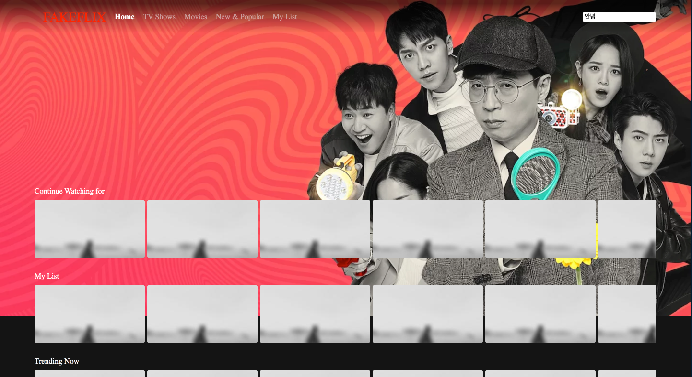
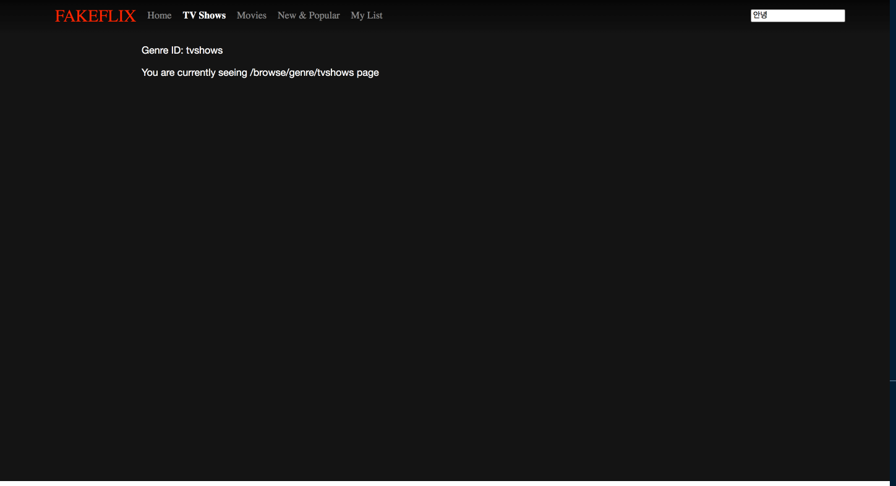
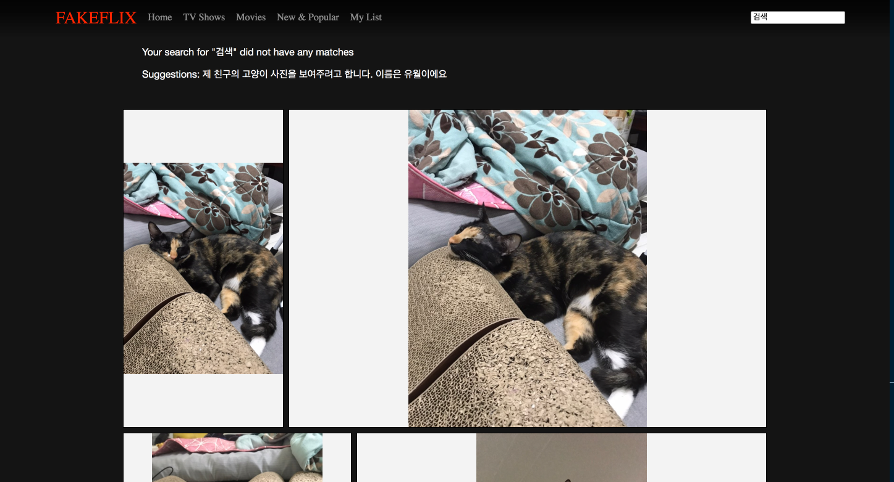

# FE-basics-with-Fake-Netflix
FE basics with Fake Netflix

## React 와 FE basics 다루기
Netflix(React로 멋지게 만든것!)처럼 잘만든 사이트를 따라하면서 React 기본기를 다시 다지고, FE basics도 익히려고 한다. 

[Visit My Website](https://romantic-goldberg-a2af0b.netlify.app/)

- 개발한 화면 
  - 메인 화면
    

  - 메뉴 선택 화면
    

  - 검색결과 화면
    

### 구현한 내용
1. Debounce
   - debounce란 검색창에 여러동작이 연달아 일어날때 마지막이나 제일 처음의 동작만 수행하는 것이다. 
   - ex) 글자가 타다타다닥 연달아 쳐지면 제일 마지막에 search function이 실행 되는것(따다다다닥 뭔가를 치고 200ms동안 아무일도 없으면 실행, 이 시간내에 뭔일이 있으면 타이머를 다시 설정)
   - 200ms라는 시간을 설정하면, 200ms동안 아무일도 없으면 API를 날리고, 200ms내에 뭔 동작이 있으면 타이머를 거기서 부터 다시 200ms로 설정한다. 그래서 계속 따다다다다다다다닥 치고 200ms를 쉬면 그때야 API를 날린다. 

  - [소스 코드 보기](./src/utils/debounce.ts)

  - 사용 예시(searchBtn.tsx)
    - 파일내에서 search 창에 입력이 있을때 200ms 동안 아무일도 없을 때 state를 업데이트 해준다
  
    ```javascript
    const SearchBtn: React.FC = () => {
      const [searchWord, setSearchWord] = useState('');

      const searchInit = (e: React.ChangeEvent<HTMLInputElement>[]) => {
          // 지정된 시간동안 이 함수가 여러번 호출되면 제일끝에 200ms동안 아무일도 없으면 검색하기!
          setSearchWord(e[0].target.value);
      };

      // debounce에 searchInit 함수를 넘겨준다. 그래서 debounceSearch에 event를 넘겨줘서 처리하는 함수를 만든다.
      const debounceSearch = debounce(searchInit, 200);

      return (
          <div>
              <input
                  onChange={(e: React.ChangeEvent<HTMLInputElement>) => {
                      debounceSearch(e).then((result) => console.log('실행 여부', result));
                  }}
              />
    ```

2. Throttle
   - 마지막에 호출한후, 일정 시간이 지나야 다른 함수를 호출할 수 있는 것
   - ex) 스크롤 이벤트가 연속적으로 발생할때(쭉 올리고 내리면 엄청 많이 발생함) 뭔 동작을 하게하면 수천번 동작해가지구 난리를 치는데, 몇초에 한번만 어떤 동작을 하게 제한 하는것.
   - 스크롤을 debounce로하면 계속 뭔가 타이머가 리셋이 되가지고, 스크롤을 하다가 멈춰야만 어떤 동작을 실행하는데, throttling을 해야 적어도 지정한 시간에 한번은 실행하는거다. 
   - [소스 코드 보기](./src/utils/throttle.ts)

   - 사용 예시(BrowseMain.tsx)
     - main 페이지에서 마우스 휠 이벤트가 발생할때 적어도 200ms에 한번은 현재 위치를 검사해서 새로운 컨텐츠를 더 불러올지 말지를 결정한다. 
      ```javascript
      const infiniteLoad = () => {
          const totalHeight = document.documentElement.offsetHeight; // 현재 문서의 전체 높이(가려진것도 다 포함)
          const hiddenHeight = document.documentElement.scrollTop; // 위에 스크롤해서 가려진 부분의 높이, 즉 내가 스크롤해서 가려진 부분의 높이
          const clientHeight = document.documentElement.clientHeight; // 현재 화면의 높이
          const check = hiddenHeight + clientHeight; // 그래서 즉, 가려진 높이(hiddenHeight)와 현재 화면의 높이를 합하면 현재 문서의 전체 높이가된다.
          // 즉 그래서 스크롤을 끝까지 하면 문서크기랑 check가 같아진다.
          // 그래서 문서의 전체 높이보다 조금작을때까지 보다 커지면, 즉 스크롤 쭉해서 완전 바닥까지 다 내리기 직전에 listCount를 하나 증가시켜서 새로운 list를 그려준다.
          if (check > totalHeight - listHeight * 3) {
              if (listCount < 45) {
                  setListCount((listCount) => listCount + 1);
              }
          }

          // 현재 스크롤로 가려진 부분의 높이
          if (setScroll) {
              setScroll(hiddenHeight);
          }
      };
      // throttle
      const throttleWheel = throttling(infiniteLoad, 200);

      return (
          <>
              <MainWrapper
                  ref={main}
                  onWheel={() => {
                      throttleWheel();
                  }}
      ```

3. Image Lazy Loading
   - 이미지 좌우 스크롤 시 IntersectionObserver API 통해서 lazy loading 을 구현

   - Thumbnail 컴포넌트에서 기본적으로 이미지를 로드할 경우에는 src 속성, 아닌경우에는 data-src 속성을 이용해 컴포넌트를 구성한 후, IntersectionObeserver API를 통해서 화면에 나타나는 경우 src 속성으로 보이도록 구성 [소스보기](src/component/Thumbnail.tsx)

  - IntersectionObserver API는 ThumbnailList에서 observer 를 등록한다. 
    - useRef를 통해서 해당하는 Thumbnail list의 element를 가져오고, 각 element를 observer한다고 등록한다
    - 이후, 조건에 해당한 후 더이상 observer 하지 않는다고 unobserver를 한다. 
  
  


4. Infinite Scroll
  - throttling을 통해서 구현함

5. Virtual List & Justified Layout
   - 트위터처럼 엄청나게 많은 글들을 렌더링 해야할때, 어차피 위에것들을 유지하는게 나중에는 필요없어진다. 그래서 일정 부분만 렌더링하는 최적화가 필요한 것이라고 한다. 
   - 요정도 되는 페이지에서는 사실 필요하지는 않았지만 개념적으로는 익히기 위해서 검색을 했을때 유월이(친구 고양이) 사진이 나오는 부분에서 virtual List와 justified layout 개념을 적용해 보았다. 
   - [소스보기](src/component/PhotoList.tsx)

   

   - 이렇게 블락 형식으로 보이고, 보이는 부분의 컨텐츠만 그리고 있다. 
   - throttle 기법을 활용해서 스크롤 이벤트가 보일때 화면의 어느 부분이 보이는지 확인 한 후, 보이는 부분만 그리도록 한다.
  
   ```javascript
   const throttleWheel = throttling(() => {
        const hiddenHeight = document.documentElement.scrollTop; // 위에 스크롤해서 가려진 부분의 높이, 즉 내가 스크롤해서 가려진 부분의 높이
        setVisibleList(getVisibleList(breakedList, hiddenHeight));
        if (setScroll) {
            setScroll(hiddenHeight);
        }
    }, 500);
    ```


6. TypeScript Migration
  - https://www.sitepoint.com/how-to-migrate-a-react-app-to-typescript/
  - 위를 보고 typescript, eslint, prettier를 설정했다.
  - volta를 통해서 node와 yarn 버전도 고정했다

## 후기
꽤 장기간에 걸쳐 여러 개념을 공부하면서 만들었다. 이미지 처리 관련 한 부분은 계속 공부해보면 재밌을것 같다.특히 이 프로젝트는 그냥 일부러 이미지를 많이 넣어봤는데, 이렇게 이미지가 많은 페이지는 최적화가 까다롭겠구나 깨달을 수 있는 시기였다. 특히 TypeScript로 마이그레이션 하기 위해서 내가 짠 코드를 다시 봤는데 다시볼때 잘 이해가 안되는 부분도 있었다. 특히, `debounce와 throttle, IntersectionObserver API` 는 유용하게 많이 쓸 개념 같은데 쓰고 돌아서면 까먹고의 반복이라, 다른 프로젝트를 하면서도 꾸준히 개념을 기억해야겠다!(원래는 라이브러리도 많이 쓰는것 같다)


