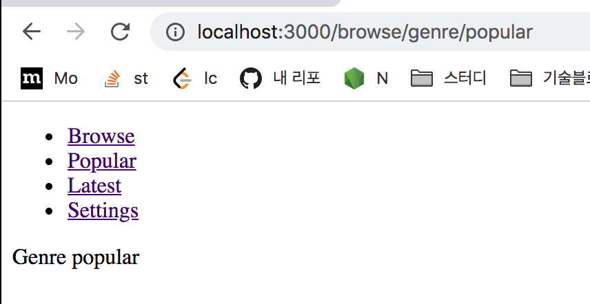
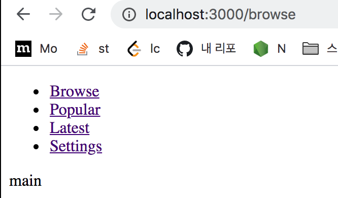
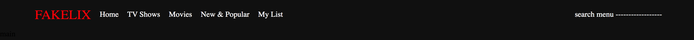
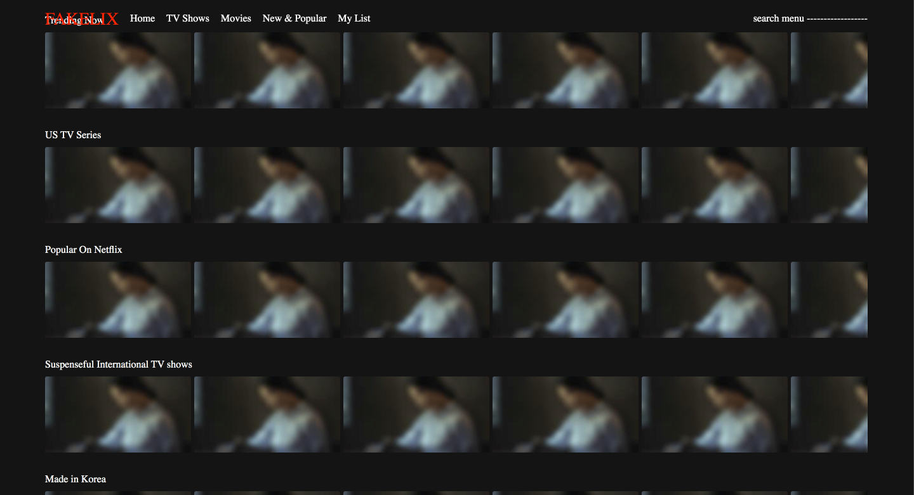
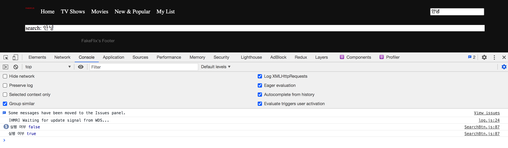
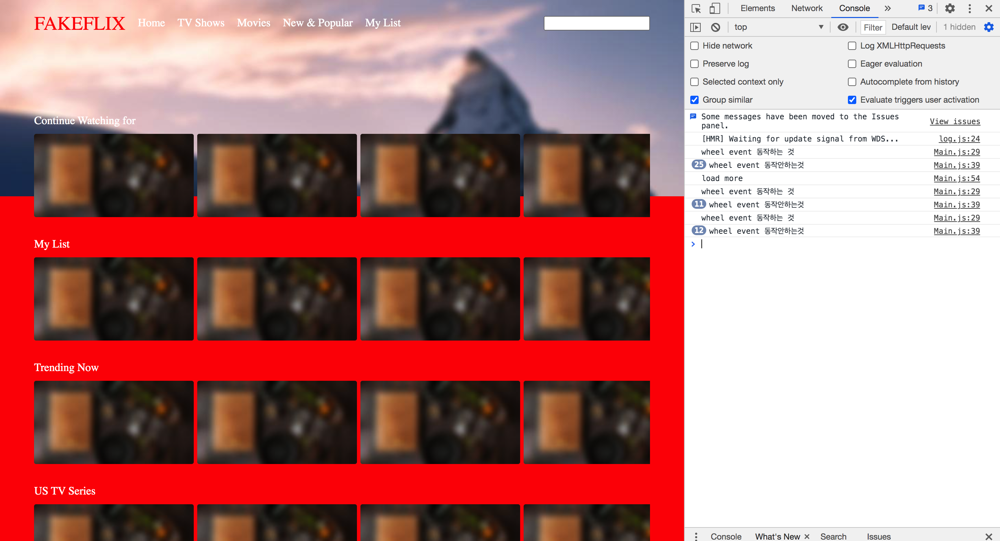
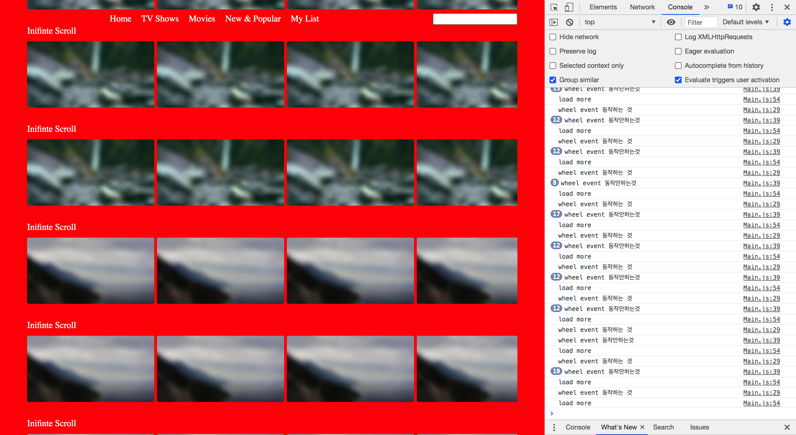
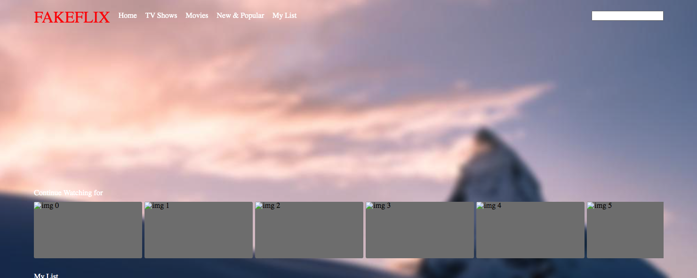
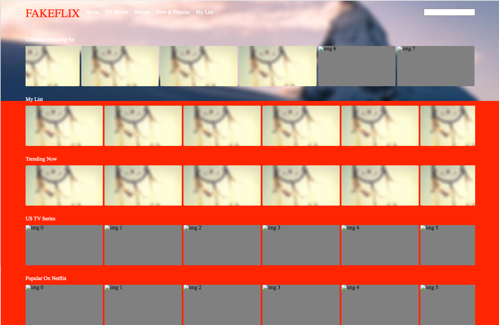
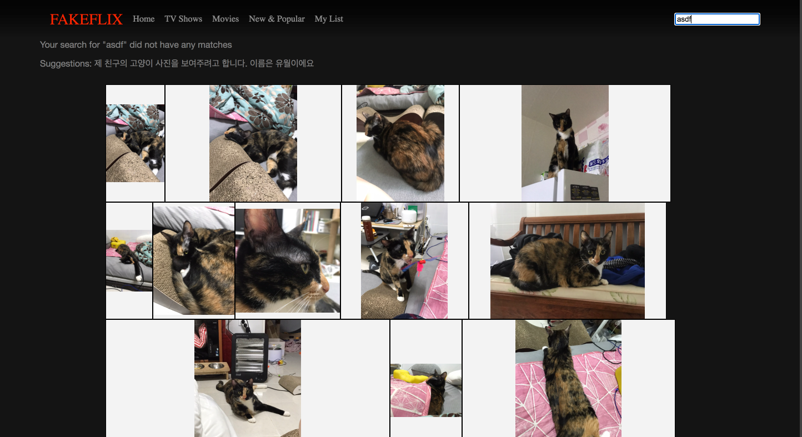

# FE-basics-with-Fake-Netflix
FE basics with Fake Netflix

## React 와 FE basics 다루기
Netflix(React로 멋지게 만든것!)처럼 잘만든 사이트를 따라하면서 React 기본기를 다시 다지고, FE basics도 익히려고 한다. 

[Visit My Website](https://romantic-goldberg-a2af0b.netlify.app/)


### 공부할 주제 소개
- [Debounce](memo/Debounce.md)
- [Throttle](memo/Throttle.md)
- [Image Lazy Loading](memo/ImageLazyLoading.md)
- [Infinite Scroll](memo/InfiniteScroll.md)
- [Virtual List](memo/VirtualList.md)
- [Justified Layout](memo/JustifiedLayout.md)
- [Repaint vs Reflow](memo/RepainAndReflow.md)

### 구조를 참고할 프로젝트
- [real-app-react](https://github.com/gothinkster/react-redux-realworld-example-app)

- [netflix](https://www.netflix.com/browse)

- [koa란?](https://backend-intro.vlpt.us/) / [koa vs express](https://geonlee.tistory.com/217)

### 참고한 내용
- [styled-components](https://styled-components.com/docs)
- [picsum](https://picsum.photos/)
  
## 학습 내용
### 1단계 프로젝트 구조 잡기(Route 관련)
1. components 폴더를 만들고, 필요할 것 같은 컴포넌트를 생성했다. 

2. [react-router](https://reactrouter.com/)
- App.js에서 Header, Footer, 그리고 라우트 처리를 한다
- 라우팅 설정하기: [참고자료](https://velopert.com/2937)
- [react-router-docs](https://reactrouter.com/web/guides/quick-start)
    ```
    yarn add react-router-dom
    ```
  




react router를 통해서 간단하게 라우터를 구성했다. 해보고 다른게 더 좋으면 그때 써보려고 한다. 

### 2단계 main 리스트 구성하기

- Header 구성하기: [layout 잡기](https://heropy.blog/2018/11/24/css-flexible-box/)
  - layout 은 styled-components를 사용해서 스타일을 적용했고, layout은 flex를 이용해서 했는데, 공부한지 좀 되서 나중에 레이아웃 잡는것만 싹 한번 정리를 하긴 하려고 한다. 
  - 헤더 구성
  

- thumbnail이 보이고 등등 main의 레이아웃 구성하기
  

  

  오랜만에 레이아웃을 잡고하니까 좀 헷갈리긴 하는데, 이번에 해보고 다음에 다른 프로젝트를 하면 좀더 기억이 날 것 같긴하다. 이미지는 지금까지는 고정으로 구성하고, 스크롤 등 필요할 기능들은 구현을 했다. 
  
  이제 이를 바탕으로 필요한 이미지만 로드 할 수 있도록 하고, 무한 로딩은 필요한건 아닌데 한번 넣어보고 싶다. 


## 3단계 Debounce와 Throttling(Lazy loading)
- [참고한 제로초 님의 블로그](https://www.zerocho.com/category/JavaScript/post/59a8e9cb15ac0000182794fa)
  
- 검색할때 검색이 끝나면 결과를 보이도록만들기(Debounce, Throttle)

- Debounce: 여러번 연달아 동작이 있으면 마지막이나 제일처음것만 실행하게 하는것
  - ex) 글자가 타다타다닥 연달아 쳐지면 제일 마지막에 search function이 실행 되는것(따다다다닥 뭔가를 치고 200ms동안 아무일도 없으면 실행, 이 시간내에 뭔일이 있으면 타이머를 다시 설정)
  - 200ms라는 시간을 설정하면, 200ms동안 아무일도 없으면 API를 날리고, 200ms내에 뭔 동작이 있으면 타이머를 거기서 부터 다시 200ms로 설정한다. 그래서 계속 따다다다다다다다닥 치고 200ms를 쉬면 그때야 API를 날린다. 

- Throttling: 마지막에 호출한후, 일정 시간이 지나야 다른 함수를 호출할 수 있는 것
  - ex) 스크롤 이벤트가 연속적으로 발생할때(쭉 올리고 내리면 엄청 많이 발생함) 뭔 동작을 하게하면 수천번 동작해가지구 난리를 치는데, 몇초에 한번만 어떤 동작을 하게 제한 하는것.
  - 스크롤을 debounce로하면 계속 뭔가 타이머가 리셋이 되가지규, 그냥 스크롤을 쭉하면 다 움직이고 멈춰야만 어떤 동작을 실행하는데, throttling을 해야 적어도 지정한 시간에 한번은 실행하는거다. 


1. Debounce 사용하기 
- Debounce를 이용해서 Search 기능을 만들기: [debounce 구현하기 예제](https://jungdujang.medium.com/javascript-debounce-%EA%B5%AC%ED%98%84-%ED%95%98%EA%B8%B0-4838b7f7efcf)
  - debounce는 closure를 이용해서 구현한다. 
  - promise가 없는 버전
  ```javascript
  const debounce = (fn, wait) => {
    let lastTimeoutId = null;
    // 클로저, 아래의 내용을 반환한다.
    return (...args) => {
      // 1. 제일 처음 반환할때는, lastTimeoutId===null 이라, if는 건너뛰고 setTimeout을 설정하게 된다.
      // 2. 다시한번 실행될때, lastTimeoutId가 혹시 설정이 되어있으면(null이 아니면), timer를 초기화하고, 다시 setTimeout을 설정한다.
      // 3. 이렇게 계속 실행될때마다 lastTimeoutId가 null이 아니면 그전에 타이머 설정한걸 계속 무력화 시킨다.
      if (lastTimeoutId) {
        // 이전에 불린게 있으면, timeout을 clear한다.
        clearTimeout(lastTimeoutId); // lastTimeoutId는 마지막 명령을 가리킨다
        lastTimeoutId = null; // 이렇게 아예 해제한다
      }

      // 그러다가 4. setTimeout내의 함수가 실행되면, 우리가 첨에 넘겨순 fn에 모든 인자를 넘겨주고, lastTimeoutId를 초기화한다.
      // 5. 이때 클로저 특성때문에 lastTimeoutId는 계속 남아있다!
      lastTimeoutId = setTimeout(() => {
        // wait 시간동안 기다리는 새로운 setTimeout 함수를 설정한다, 여전히 lastTimeoutId로 가리킨다
        // 시간이 되면 얘가 실행되고, lastTimeoutId를 해제한다. 그래야 다음에 새로 시작하는애들은 또 null로 시작하니까

        fn(...args); // 함수에 모든 인자를 넘겨준다
        lastTimeoutId = null;
      }, wait);
    };
  }; 
  ```
  - promise가 있는 버전
  ```javascript
  // promise를 이용해서 비동기 처리(settimeout이 제대로 수행됬는지 아닌지 확인)
  // 1. 여기서 lastTimeoutId는 기존처럼 마지막거를 가리킨다. 그래가지구, 여전히 setTimeout잘되면 해제해주고, 그런동작은 그대로다.
  // 2. 근데 여기서는 한번더 감싸가지구 promise를 반환했어서 debouncedLog(1) 한다고 뭐 바로 다 끝나는거 아니고, thenable한 객체가 반환된다.
  // 3. 이대 checkTimeoutId가 등장하는데 얘는 내가 현재 뭔지를 가리킨다. 즉, lastTimeout는 여러 setTimeout이 공유해서 쓰는거고,checkTimeoutId는 현재거라,
  // setTimeout이 제때 실행되서 clear해주는게 아니면 실행되는 부분이다
  const debounce = (fn, wait) => {
    let lastTimeoutId = null;
    // 클로저, 아래의 내용을 반환한다.
    return (...args) => {
      // 여기를 한번 더 감싸서 promise 함수를 반환한다.
      return new Promise((resolve) => {
        let checkTimeoutId = null;

        if (lastTimeoutId) {
          // 이전에 불린게 있으면, timeout을 clear한다.
          clearTimeout(lastTimeoutId); // lastTimeoutId는 마지막 명령을 가리킨다
          lastTimeoutId = null; // 이렇게 아예 해제한다
        }

        lastTimeoutId = setTimeout(() => {
          clearTimeout(checkTimeoutId);
          fn(...args); // 함수에 모든 인자를 넘겨준다
          resolve(true);
          lastTimeoutId = null;
        }, wait);

        // wait만큼 기다렸는데, clearTimeout안되면 얘를 실행한다.
        checkTimeoutId = setTimeout(() => {
          resolve(false);
        }, wait);
      });
    };
  };
  ```
  - promise로 한경우 실행 화면: wait을 200ms로 줘서 걔가 끝나면 실행하고, 아닌건 false라고 결과를 출력한다. 
  
  

  - search 의 구조:
  ```javascript
  const searchInit = (e) => {
    // 지정된 시간동안 이 함수가 여러번 호출되면 제일끝에 200ms동안 아무일도 없으면 검색하기!
    setSearchWord(e.target.value);
  };
  const debounceSearch = debounce(searchInit, 200);
  ```

  ```javascript
    <div>
      <input
        onChange={(e) =>
          debounceSearch(e).then((result) => console.log("실행 여부", result))
        }
      />
      {/* search Word가 없으면 browse로 redirect */}
      {!searchWord && (
        <Redirect
          to={{
            pathname: "/browse",
          }}
        />
      )}
      {/* search word가 있으면 그에 해당하게 이동 */}
      {searchWord && (
        <Redirect
          to={{
            pathname: "/search",
            search: `?q=${searchWord}`,
          }}
        />
      )}
    </div>
  ```
  이렇게 debounce를 활용해서 성공한 경우든 아니든 console.log를 출력하고, 성공하면 searchInit이라는 함수를 실행해서 state를 업데이트 해주면 searchBtn 컴포넌트가 리렌더링 된다. 
  그러면 searchView로 리다이렉트 하거나, 글자가 하나도 없으면 browse화면으로 redirect한다.


2. Throttling 구현하기 
- throttling을 통해서 상하로 무한 스크롤 하는것을 구현하기 
- 무한 스크롤 만들어보기(더 좋은 방법도 공부하기)
  - [Javascript - 디바운싱, 쓰로틀링](https://zinirun.github.io/2020/08/16/js-throttling-debouncing/)
  - [무한 스크롤 만들기](https://velog.io/@hyeon930/%EB%AC%B4%ED%95%9C-%EC%8A%A4%ED%81%AC%EB%A1%A4-%EB%A7%8C%EB%93%A4%EA%B8%B0-Throttling)
  - [throttle 구현](https://pewww.tistory.com/9?category=750230)

- wheel event를 200ms에 한번은 꼭 실행하게 하기
  ```javascript
  const throttling = (fn, waits) => {
      let throttleCheck = null; // 처음에 false로 생성

      return (...args) => {
        if (!throttleCheck) {
          console.log("wheel event 동작하는 것");
          // false이면 setTimeout을 설정할 수 있다. 그다음에는 throttle은 뭔가를 가리키고 있다.
          // 그러고 나서 event가 발생하는 동안은 이 if block안에 못들어와서 이걸 실행할 수가 없다.
          // 얘가 끝나야 다시 새로운 동작을 등록할 수 있다. 그리고 처음에 시작한건 지정한 시간이 지나면 한번은 실행된다.
          // debounce는 동작이 연달아 쭉있으면 앞에껀 다 timer가 클리어되는데 반해 얘는 쭉있으면 그래도 지정한 시간만다 한번은 실행한다.
          throttleCheck = setTimeout(() => {
            fn(...args);
            throttleCheck = null;
          }, waits);
        } else {
          console.log("wheel event 동작안하는것");
        }
      };
    };

    const infiniteLoad = () => {
      console.log("wheel event");
    };
    // throttle
  const throttleWheel = throttling(infiniteLoad, 100);

  <MainWrapper
    bg={"https://picsum.photos/seed/picsum/1000/400/?blur"}
    onWheel={(e) => {
      throttleWheel();
    }}
  >
  ```
 
  - Wheel 이벤트가 발생할때 적어도 200ms 한번은 지금 현재 위치가 어딘지 체크해서 리스트를 추가적으로 더 보여줄지 결정하려고 한다. onWheel이벤트는 이전처럼 계속 실행을 하는데 throttleWheel 내에서 200ms마다 내가 실행하고자하던 함수를 실행하도록 했다. 
  
  ```javascript
  const infiniteLoad = () => {
    const totalHeight = document.documentElement.offsetHeight; // 현재 문서의 전체 높이(가려진것도 다 포함)
    const hiddenHeight = document.documentElement.scrollTop; // 위에 스크롤해서 가려진 부분의 높이, 즉 내가 스크롤해서 가려진 부분의 높이
    const clientHeight = document.documentElement.clientHeight; // 현재 화면의 높이
    const check = hiddenHeight + clientHeight; // 그래서 즉, 가려진 높이(hiddenHeight)와 현재 화면의 높이를 합하면 현재 문서의 전체 높이가된다.
    // 즉 그래서 스크롤을 끝까지 하면 문서크기랑 check가 같아진다.
    // 그래서 문서의 전체 높이보다 조금작을때까지 보다 커지면, 즉 스크롤 쭉해서 완전 바닥까지 다 내리기 직전에 listCount를 하나 증가시켜서 새로운 list를 그려준다.
    if (check > totalHeight - listHeight * 3) {
      console.log("load more");
      setListCount((listCount) => listCount + 1);
    }
  };
  ```

  `infiniteLoad`는 무한히 로드를 하는 함수로, wheel event가 동작할때 `문서의 전체 높이 - 리스트의 높이 * n`와 `스크롤한 높이 + 현재 화면의 높이`를 비교해서 `스크롤한 높이 + 현재 화면의 높이`가 더크면 listCount를 증가시켜서 보이는 list를 추가해서 그려준다. 

  이때 `InfiniteContents`라는 컴포넌트는 listCount를 props로 받고 `getContents`라는 함수를 통해서 무한히 컨텐츠를 가져오도록 구현했다. 

  ```javascript
  const getContents = () => {
    let index = 0;
    return () => {
      index += 1;
      if (index > 32) {
        index = 33;
      }
      return contents[index];
    };
  };
  const InfiniteContents = ({ listCount }) => {
    const contentsGenerator = getContents();
    /// 계속
  ```

  이렇게 contents라는 json 객체에서 데이터를 읽어오되 32개 이후로는 계속 똑같이 33번째 객체를 읽어온다. 

  ```
  /// json data 일부
  32: {
    name: "Bingeworthy International TV Shows",
    length: 10,
  },
  33: {
    name: "Inifinte Scroll",
    length: 10,
  },
  ```
  - 실행화면

    
    
    처음 로드하면 컨텐츠가 보인다. 


    

    스크롤이벤트가 발생하면 200ms한번은 높이를 확인하고, 경우에 따라 새로운 리스트를 추가해서 보여주고, 무한히 스크롤하면 데이터를 가지고 온다. 

  - 정리하면: throttle기법을 통해서 wheel event가 연속적으로 발생하더라고, 적어도 200ms에 한번은 실행하도록 했고, 이때 높이 조건에 따라 list를 추가적으로 보이도록 구현했다. 

3. 이미지 좌우 스크롤 시 IntersectionObserver API 통해서 lazy loading 하기(안보는 이미지는 굳이 왜불러)
    

    이런 스크롤 메뉴가 있다. 이때 무조건 보이는 앞에 6개는 부를때 불러주고, 나머지는 스크롤하면 그때서야 이미지를 로드해오고자 한다(실제로는 더 여유롭게 불러올것 같긴하다!) 그리고 처음에 안보이는 리스트들도 img를 로드하지 않도록 했다. 

    - 우선 메인 페이지를 처음 로드했을때 안보이는 부분은 img를 로드하지 않도록 화면을 구성했다. 
      
      

    - 코드
    ```javascript
    function ThumbnailList({ name, length, loadImgCount }) {
      const [loadImageCount, setLoadImageCount] = useState(loadImgCount);
      const imgs = useRef();

      const callBack = (entries, observer) => {
        entries.forEach((entry) => {
          if (entry.isIntersecting) {
            setLoadImageCount((loadImageCount) => loadImageCount + 1);
            observer.unobserve(entry.target);
          }
        });
      };

      useEffect(() => {
        const childImgs = imgs.current.children;
        const io = new IntersectionObserver(callBack);
        let idx = 0;
        for (let child of childImgs) {
          if (idx >= loadImageCount) {
            io.observe(child);
          }
          idx += 1;
        }
        // eslint-disable-next-line
      }, []);
    ```
      해당 API를 통하면 언제 화면에 특정 컴포넌트가 보이는지를 쉽게 알 수 있다. 그래서 특정 컴포넌트가 화면에 보이면 loadImageCount를 증가시켜서, Thumbnail 컴포넌트에서 image를 로드하도록 처리했다.
   
4. [useContext로 상태관리 한번 해보기](https://reactjs.org/docs/hooks-reference.html#usecontext)

`provider가 없으면 defaultValue를 사용한다`


## 4단계 Search 화면 구현하기
Debounce를 통해 연달아 타이핑 하는 경우에 event가 더이상 발생하지 않는 순간에 search페이지로 이동하도록 했다. 이 화면을 이제 채워 보려고 한다. 

1. [Virtual-list 공부](./memo/VirtualList.md) 정린
- 보이는 영역 근처로만 아이템이 그려지도록 하는 것

2. [Masonry 레이아웃, Justified layout](https://d2.naver.com/helloworld/6807203)
- Masonry(벽돌 쌓기): 
  - 벽돌처럼 동일한 너비의 이미지를 쌓아올리는 것. 높이는 다를 수 있다. 
  - 이미지 순서가 유지되지 않는다
  - 완성된 레이아웃에 새로운 이미지를 추가하기 용이
  - 원본 이미지의 가로세로비가 유지됨

- Justified 레이아웃(1행의 너비에 맞게 꼭 들어찬)이라는 의미를 가진 인쇄 용어라고 한다. 한행을 기준으로 이미지가 가득 차도록 배치하는 레이아웃
  - [line breaking알고리즘](http://blog.vjeux.com/2014/image/google-plus-layout-find-best-breaks.html) 을 응용해서 어디서 줄바꿀지를 정한다. 


3. Reflow와 Repaint
- [참고자료](https://webclub.tistory.com/346#:~:text=%EC%83%9D%EC%84%B1%EB%90%9C%20DOM%20%EB%85%B8%EB%93%9C%EC%9D%98,%EB%90%9C%20%EB%A0%8C%EB%8D%94%20%ED%8A%B8%EB%A6%AC%EB%A5%BC%20%EB%8B%A4%EC%8B%9C)

- Reflow는 Dom의 레이아웃 변경에 영향을 받은 모든 노드의 수치를 다시 계산해서 렌더트리를 다시 그리는데, `Reflow`한 다음에는 `Repaint`를 한다
  ```javascript
    function reflow(){
      document.getElementById('sample').style.width = '600px'
    }
  ```

- Repaint는 스타일 중에서 레이아웃 변경이 아닌 background-color, visibility, outline등이 변경될때 `Reflow`과정은 생략하고 `Repaint`만 발생한다


4. search 페이지는 유월이 사진으로 채우겠습니다
- [flicker의 justified-layout](http://flickr.github.io/justified-layout/) 을 활용해서 그리기. throttle을 이용해서 Virtual-list 적용?

  

  이미지를 내친구 고양이로 해가지구, div를 justified-layout에서 주는 스타일을 적용했다.

- [virtual list 관련 보던 미디엄 글](https://medium.com/ingeniouslysimple/building-a-virtualized-list-from-scratch-9225e8bec120)


## 5단계 프로젝트 구조 개선


<!-- - [일상님..](https://github.com/1ilsang/never-cloud/blob/master/package.json) -->
## 후기


## ## 참고한 문서 및 끝나고 더 공부할것
1. [react-router](https://reactrouter.com/web/api/Redirect/to-string):  추가 공부하기

2. [what is public folder](https://create-react-app.dev/docs/using-the-public-folder/)

3. [adding typescript](https://create-react-app.dev/docs/adding-typescript/)

4. [typescript cheatsheets](https://github.com/typescript-cheatsheets/react#reacttypescript-cheatsheets)


<!-- 
- 이미지 여러개 보이게 하기(스크롤 계속해서 보이도록) (Image Lazy Loading)


1. [react-router-redux](https://www.npmjs.com/package/react-router-redux)
  - 처음 진입하는 화면(로그인 후 프로파일 설정화면)
  - 메인 화면(계속 늘어나는)
  - 네비게이션 선택마다 비슷한 모양인데도 다르게 보이도록 구성(장르별로 보이는 것)
  
1. [react-redux](https://react-redux.js.org/)

2. [redux-saga](https://redux-saga.js.org/)
   
3. styled-component
- 이미지는 그냥 랜덤하게 아무거나 보이도록 만들기

### 2단계 메인 페이지 처리하기
- 계속 로딩 늘어나는것(컨텐츠가 다 보일때까지) - image lazy loading, infinite scroll 등의 개념을 적용하지 않을까 예상
- 검색하면 검색 대상만 보여주기 - 검색시에 debounce/throttle의 개념을 확실히 다질것으로 예상
- layout을 잡기위한 고민

### 3단계 컴포넌트 재활용하기
- 메인 페이지에서 생성한 컴포넌트를 재활용해서 다른 페이지도 보일 수 있도록

### 4단계 마크업을 마무리하기
- account 페이지는 그냥 마크업 연습만 하는 정도로! -->
