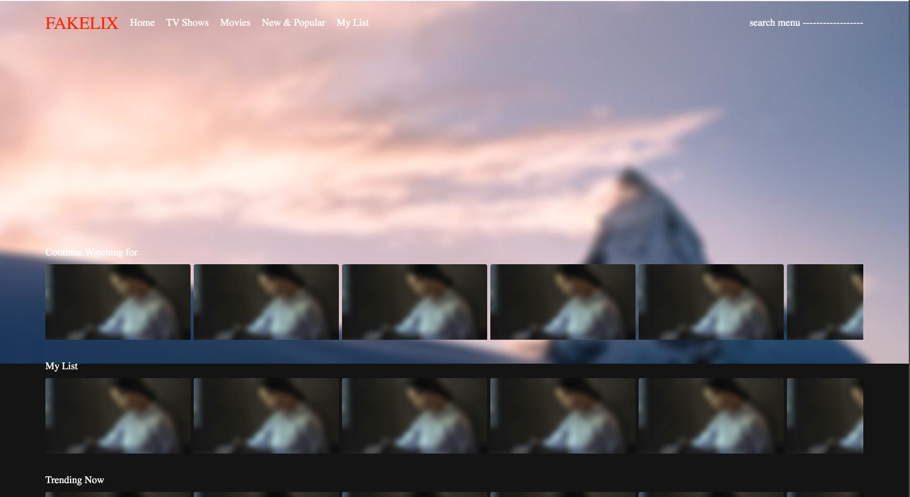

# FE-basics-with-Fake-Netflix
FE basics with Fake Netflix

## React 와 FE basics 다루기
Netflix(React로 멋지게 만든것!)처럼 잘만든 사이트를 따라하면서 React 기본기를 다시 다지고, FE basics도 익히려고 한다. 

[Visit My Website](https://romantic-goldberg-a2af0b.netlify.app/)


### 공부할 주제 소개
- [Debounce](memo/Debounce.md)
- [Throttle](memo/Throttle.md)
- [Image Lazy Loading](memo/ImageLazyLoading.md)
- [Infinite Scroll](memo/InfiniteScroll.md)
- [Virtual List](memo/VirtualList.md)
- [Justified Layout](memo/JustifiedLayout.md)
- [Repaint vs Reflow](memo/RepainAndReflow.md)

### 구조를 참고할 프로젝트
- [real-app-react](https://github.com/gothinkster/react-redux-realworld-example-app)

- [netflix](https://www.netflix.com/browse)

- [koa란?](https://backend-intro.vlpt.us/) / [koa vs express](https://geonlee.tistory.com/217)

### 참고한 내용
- [styled-components](https://styled-components.com/docs)
- [picsum](https://picsum.photos/)
  
## 학습 내용
### 1단계 프로젝트 구조 잡기(Route 관련)
1. components 폴더를 만들고, 필요할 것 같은 컴포넌트를 생성했다. 

2. [react-router](https://reactrouter.com/)
- App.js에서 Header, Footer, 그리고 라우트 처리를 한다
- 라우팅 설정하기: [참고자료](https://velopert.com/2937)
- [react-router-docs](https://reactrouter.com/web/guides/quick-start)
    ```
    yarn add react-router-dom
    ```
  


react router를 통해서 간단하게 라우터를 구성했다. 해보고 다른게 더 좋으면 그때 써보려고 한다. 

### 2단계 main 리스트 구성하기

- Header 구성하기: [layout 잡기](https://heropy.blog/2018/11/24/css-flexible-box/)
  - layout 은 styled-components를 사용해서 스타일을 적용했고, layout은 flex를 이용해서 했는데, 공부한지 좀 되서 나중에 레이아웃 잡는것만 싹 한번 정리를 하긴 하려고 한다. 
  - 헤더 구성
  

- thumbnail이 보이고 등등 main의 레이아웃 구성하기
  

  

  오랜만에 레이아웃을 잡고하니까 좀 헷갈리긴 하는데, 이번에 해보고 다음에 다른 프로젝트를 하면 좀더 기억이 날 것 같긴하다. 이미지는 지금까지는 고정으로 구성하고, 스크롤 등 필요할 기능들은 구현을 했다. 
  
  이제 이를 바탕으로 필요한 이미지만 로드 할 수 있도록 하고, 무한 로딩은 필요한건 아닌데 한번 넣어보고 싶다. 

- 이미지 여러개 보이게 하기(스크롤 계속해서 보이도록) (Image Lazy Loading)

- 검색할때 검색이 끝나면 결과를 보이도록만들기(Debounce, Throttle)

<!-- 

1. [react-router-redux](https://www.npmjs.com/package/react-router-redux)
  - 처음 진입하는 화면(로그인 후 프로파일 설정화면)
  - 메인 화면(계속 늘어나는)
  - 네비게이션 선택마다 비슷한 모양인데도 다르게 보이도록 구성(장르별로 보이는 것)
  
1. [react-redux](https://react-redux.js.org/)

2. [redux-saga](https://redux-saga.js.org/)
   
3. styled-component
- 이미지는 그냥 랜덤하게 아무거나 보이도록 만들기

### 2단계 메인 페이지 처리하기
- 계속 로딩 늘어나는것(컨텐츠가 다 보일때까지) - image lazy loading, infinite scroll 등의 개념을 적용하지 않을까 예상
- 검색하면 검색 대상만 보여주기 - 검색시에 debounce/throttle의 개념을 확실히 다질것으로 예상
- layout을 잡기위한 고민

### 3단계 컴포넌트 재활용하기
- 메인 페이지에서 생성한 컴포넌트를 재활용해서 다른 페이지도 보일 수 있도록

### 4단계 마크업을 마무리하기
- account 페이지는 그냥 마크업 연습만 하는 정도로! -->

## 참고한 문서
### create react app docs
- [what is public folder](https://create-react-app.dev/docs/using-the-public-folder/)

### react with typescript
- [adding typescript](https://create-react-app.dev/docs/adding-typescript/)

- [typescript cheatsheets](https://github.com/typescript-cheatsheets/react#reacttypescript-cheatsheets)
